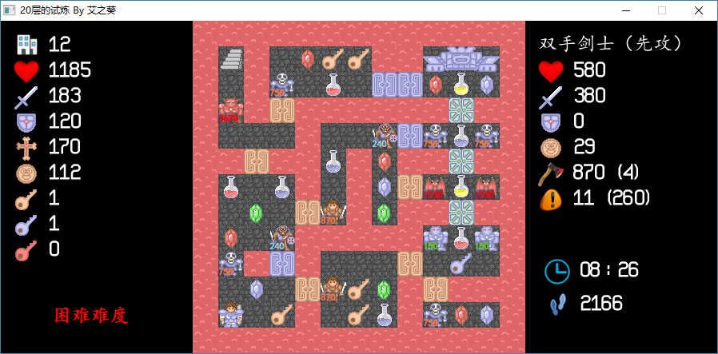

魔塔：20层的试炼
================

### 游戏说明
这是一个传统向经典风的魔塔小游戏，发布于百度贴吧魔塔吧，共有20层；经评定，本塔为红海lv2级别，已经被加为精品，欢迎大家进行挑战。

本塔由C++编写而成，使用VS2012编译，支持Windows XP及以上系统运行。同样使用C++编写的魔塔还有：[21层魔塔复刻增强版](https://github.com/ckcz123/mota)，[可变加点单层塔](https://github.com/ckcz123/mota2)，[重生塔](https://github.com/ckcz123/mota3)，等等。欢迎大家分别进行尝试。

本塔有如下特性：

  * 传统向经典风：本塔无特殊道具，除先攻魔攻坚固外无其他特殊属性，无暗墙及路障，无任何坑点，就是一部纯粹的最经典样式的魔塔。
  * 红海向：困难难度下本塔为红海，有lv2级别，需要较高的拆塔能力才能通关。
  * 有三种难度模式：简单、普通、困难。简单是针对新手的，基本乱撞可过；普通难度针对有一定经验的人，稍微思考可过；困难针对拆塔资深玩家的，难度较高。
  * 困难模式通关后会上传成绩到服务器，与大家进行比较。同时按P键可以查看当前MAX。
  * 更多的特性期待你来发掘~

下载地址：https://tieba.baidu.com/p/5403344921

### 编译运行

请使用VS2012及以上进行编译运行。  
如果使用VS2015进行编译，请将 `legacy_stdio_definitions.lib` 加入到项目库中，以免发生 `error LNK2019: unresolved external symbol _sscanf` 错误。  
**请将hge文件夹下的所有`dll`文件，以及源代码目录下的`Res`和`Save`文件夹，复制到生成文件夹中，才可以正常进行运行游戏。**   
如果有问题，请联系 `ckcz123@126.com`。  
